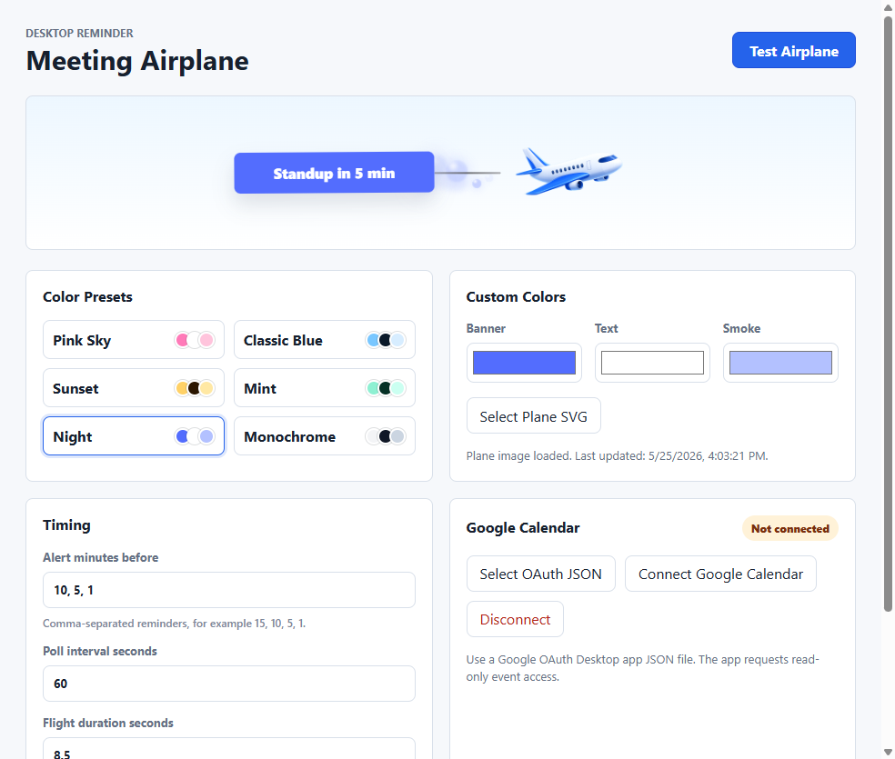
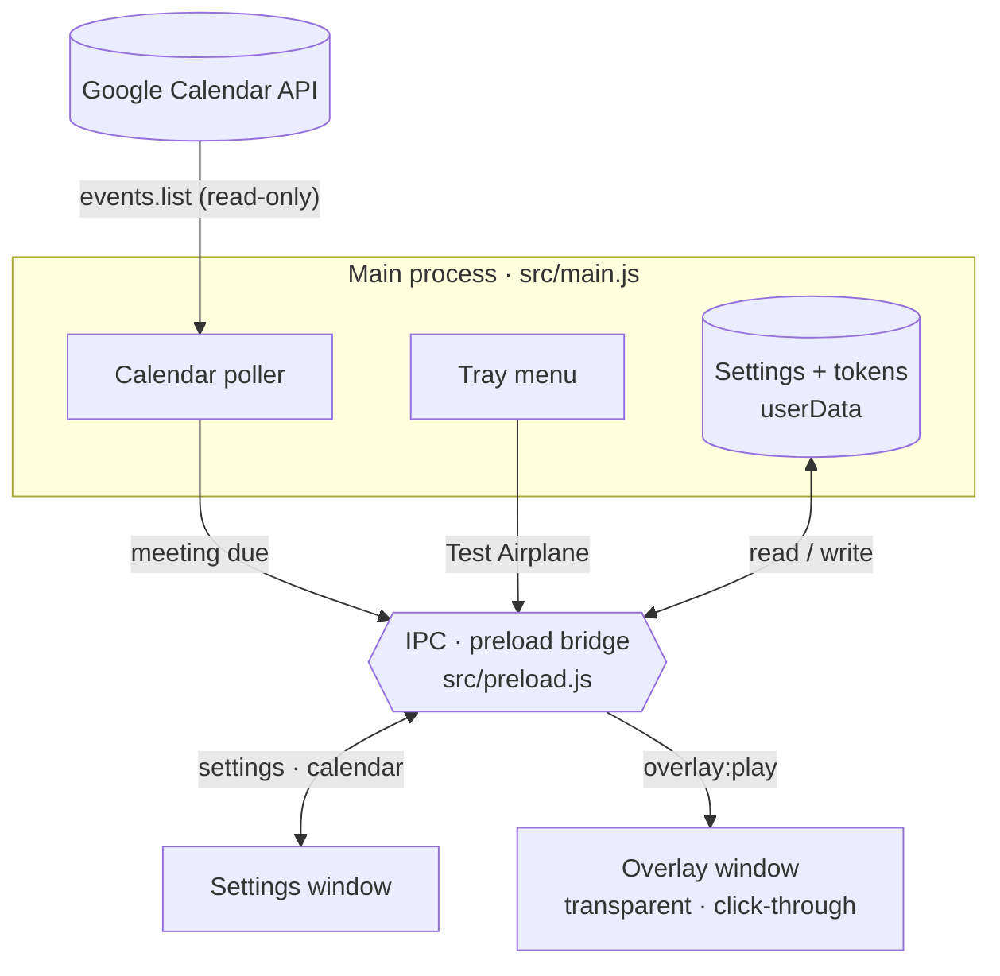

# Meeting Airplane

**A tiny plane flies across your screen towing a banner that says "Standup in 5 min", so you never miss a meeting again.**


Meeting Airplane is a Windows tray app. It watches your Google Calendar (read-only) and, a few minutes before each meeting, flies a transparent, click-through, always-on-top airplane across the screen with the meeting name on its banner. It never takes focus and ignores the mouse, so you can keep working while it passes.

<table>
  <tr>
    <td></td>
    <td></td>
  </tr>
  <tr>
    <td align="center">Settings: presets, custom colors, timing, calendar</td>
    <td align="center">Long titles truncate; the time stays visible</td>
  </tr>
</table>

## Why

Calendar pop-ups are easy to dismiss and easier to ignore. A plane crossing your screen is hard to miss, and it does not interrupt what you are doing. It was also a fun excuse to build a real Electron app end to end: tray, transparent overlay window, IPC, OAuth, packaging and CI.

## Features

- **Flying banner reminder.** A transparent, click-through, always-on-top overlay with an airplane, a smoke trail and a banner like `Standup in 5 min`. Long meeting names are truncated with an ellipsis so the "in N min" part always stays readable.
- **Color presets.** Pink Sky, Classic Blue, Sunset, Mint, Night and Monochrome.
- **Custom colors** for the banner, the banner text and the smoke trail.
- **Bring your own plane.** Click **Select Plane SVG** to swap in your own airplane image. It is copied into Electron's user-data folder as `custom-plane.svg`; the default is `src/renderer/assets/airplane.svg`.
- **Multiple alert times.** For example `10, 5, 1` flies the plane 10, 5 and 1 minutes before a meeting (whole minutes, 1 to 240).
- **Tunable flight.** Poll interval (15 to 600 s), flight duration (3 to 20 s) and vertical position on screen.
- **Start with Windows (opt-in).** Runs quietly in the tray after login.
- **Tray menu.** Open Settings, Test Airplane, Quit.
- **Test Airplane button.** Preview your colors and plane any time, from the settings window or the tray.
- **Read-only calendar access.** Uses the `calendar.events.readonly` scope only.

## Quick start

**Test Airplane works instantly, before any Google setup.** Launch the app, click **Test Airplane**, and watch the plane fly. Connect Google Calendar afterwards when you want real reminders.

### Option A: download the app (no Node.js needed)

1. Open the [latest release](https://github.com/vraj-p8/meeting-airplane/releases/latest).
2. Download `MeetingAirplane-win32-x64.zip` and extract it.
3. Run `MeetingAirplane.exe`.

The build is not code-signed, so Windows SmartScreen may warn you the first time. Choose **More info**, then **Run anyway** if you trust the source.

### Option B: run from source

You need Windows and Node.js 22.12 or newer (required by Electron 42).

```powershell
git clone https://github.com/vraj-p8/meeting-airplane.git
cd meeting-airplane
npm install
npm start
```

After `npm install` you can also double-click `Open Meeting Airplane.cmd` to start the app without a terminal.

Start with Windows is off by default. Turn it on in the settings window to have the app launch into the tray after login.

## Google Calendar setup

You bring your own OAuth client, so nothing is shared with anyone else and there is no server involved. It takes about five minutes and is a one-time step.

1. Go to the [Google Cloud Console](https://console.cloud.google.com/) and create a new project (or pick an existing one).
2. Open **APIs & Services > Library**, search for **Google Calendar API** and click **Enable**.
3. Open **APIs & Services > OAuth consent screen**. Choose **External**, fill in the app name and your email, and leave the publishing status as **Testing**.
4. On the same consent screen, under **Test users**, click **Add users** and add your own Google account. Only listed test users can sign in while the app is in Testing mode.
5. Open **APIs & Services > Credentials**, click **Create credentials > OAuth client ID**, and choose application type **Desktop app**.
6. Click **Download JSON** for the new client. See [`google-credentials.sample.json`](google-credentials.sample.json) for the expected shape (the values in it are placeholders).
7. In Meeting Airplane, click **Select OAuth JSON** and choose the downloaded file.
8. Click **Connect Google Calendar**. Your browser opens; approve read-only calendar event access. When the page says "Meeting Airplane connected", close the tab. The badge in the app changes from "Not connected".

Notes:

- Google shows an "unverified app" warning because the OAuth client is your own and in Testing mode. That is expected; continue as the test user you added.
- Google may expire sign-ins for apps in Testing mode after about a week. If reminders stop, click **Connect Google Calendar** again.
- Never commit your downloaded JSON. `google-credentials.json` is already in `.gitignore`.

### What gets watched

The app polls your **primary** calendar for upcoming events that have a start time and are not cancelled. All-day events are ignored. Each alert time fires once per event.

## How it works



- The **main process** owns everything privileged: the tray, the polling timer, the OAuth flow, settings storage and the two windows.
- The **preload script** exposes a small `window.meetingAirplane` API through `contextBridge`. The renderer windows run with `contextIsolation` on and no Node access.
- The **overlay window** covers the primary display, ignores mouse events and never takes focus. On each alert it receives the meeting title and your colors over IPC, plays the flight animation, then hides itself.
- The **settings window** reads and writes settings, starts the OAuth flow and triggers test flights through the same IPC bridge.
- **Sign-in** uses Google's desktop loopback flow. The app starts a short-lived HTTP server on `127.0.0.1` at a random port, opens your browser, checks a random `state` value on the callback, exchanges the code for tokens and shuts the server down. It gives up after two minutes.

## Privacy

- The only scope requested is `https://www.googleapis.com/auth/calendar.events.readonly`. The app cannot create, edit or delete events.
- Your OAuth client details and tokens are stored locally in Electron's user-data folder (`google-oauth-client.json` and `google-token.json`). They are plain JSON files and are not encrypted, so treat that folder as private.
- The app talks only to Google's APIs to read upcoming events. There is no analytics, telemetry or third-party server.
- It never sees your Google password; sign-in happens in your browser.
- Click **Disconnect** in the app to delete the stored token.

## Project structure

```text
.
├── src
│   ├── main.js                     # Tray, polling, OAuth, settings, windows, IPC
│   ├── preload.js                  # contextBridge API exposed to the renderers
│   └── renderer
│       ├── assets/airplane.svg     # Default plane image
│       ├── overlay.{html,css,js}   # Transparent flight overlay
│       └── settings.{html,css,js}  # Settings window
├── google-credentials.sample.json  # Shape of the OAuth Desktop client JSON
├── Open Meeting Airplane.cmd       # Launcher for source checkouts
├── .github                         # CI, release workflow, issue and PR templates
└── package.json
```

## Scripts

| Command | What it does |
| --- | --- |
| `npm start` | Run the app with Electron |
| `npm run dev` | Same as `npm start` |
| `npm run smoke` | Launch briefly in smoke-test mode and exit |
| `npm run check` | Syntax-check the main, preload and renderer scripts |
| `npm run package:win` | Build a Windows x64 app with `@electron/packager` into `release/MeetingAirplane-win32-x64` |

To publish a release, push a tag such as `v0.1.0`. The release workflow packages the app, zips it as `MeetingAirplane-win32-x64.zip` and attaches it to a GitHub Release.

## Roadmap

These are ideas, not promises.

- Show the plane on every monitor (today it uses the primary display).
- Choose which calendars to watch, skip declined events, and optionally include all-day events.
- Optional sound with the flyover.
- A "snooze" or "skip this meeting" control.
- A Windows installer and code signing so SmartScreen stays quiet.
- Auto-update.
- A small gallery of built-in planes and banner styles.
- macOS and Linux support.

## Contributing

Issues and pull requests are welcome. See [CONTRIBUTING.md](CONTRIBUTING.md) for setup and the checklist.

## License

[MIT](LICENSE) (c) 2026 Vraj Patel.

Inspired by a viral reel of a meeting-reminder plane.
